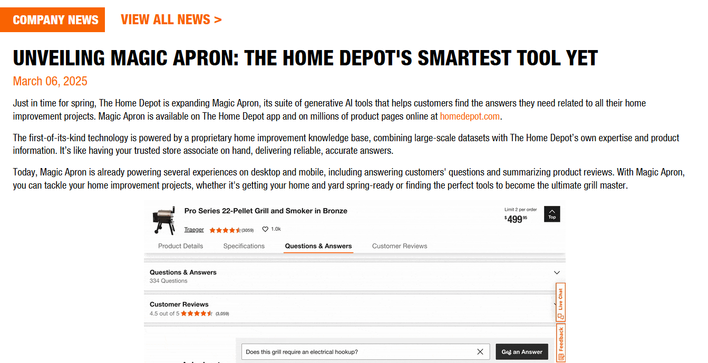
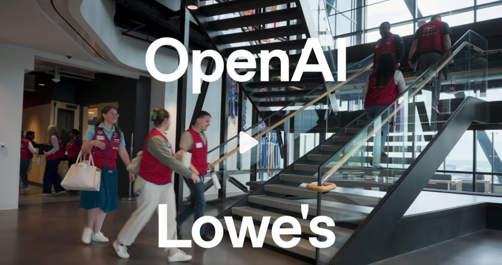
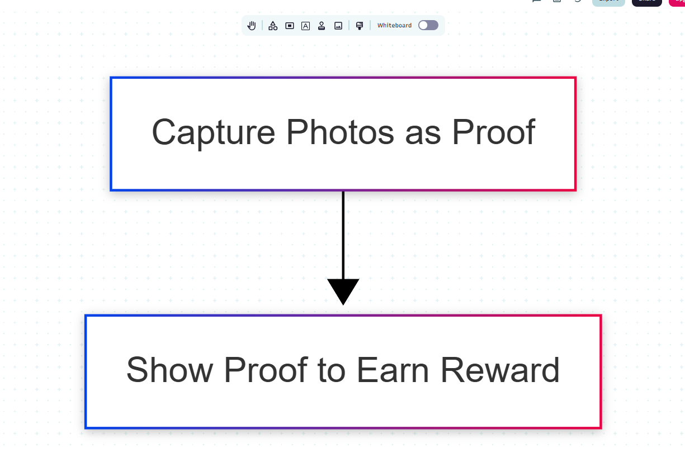
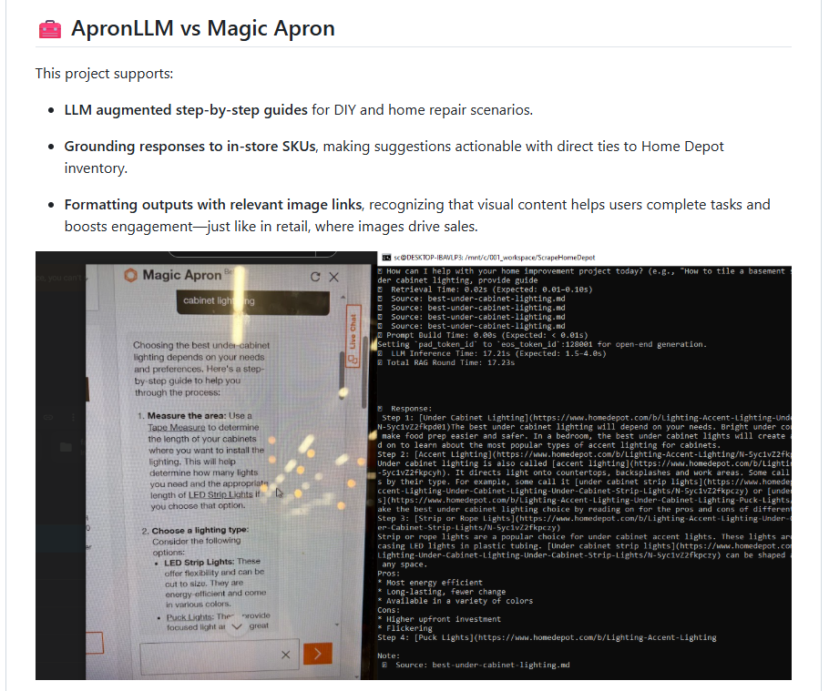

# Poway UO Trial — Compassionate Associates Leading the Introduction of AI at Work  

Home Depot has launched a new AI tool called **Magic Apron**.  Here at **Store Poway**, we — the associates — want to try it out.

We want to start a **User Onboarding (UO)** trial to introduce this tool to customers and learn from the hands-on experience. We will focus on:

- Associate Use — How Magic Apron fits into daily work, helps reduce errors, saves time, and builds confidence.

- Customer Experience — How shoppers respond to the tool: Is it easy to use? Helpful? Would they choose to use it again?

- Business Impact — How the tool influences customer decisions, shopping speed, and basket size.

- Sale Lead — Whether this AI generate leads to higher sales.

We’re excited about this pilot — because we believe using AI can make work more rewarding for associates — and more impactful for the business.

 
 

**Poway UO**: Exploring how this tool can support associate's daily work and boost store revenue.

\newpage

## 1: Project Highlights  

| **What We’re Looking Into** | **How We’re Testing It** |
|-----------------------------|---------------------------|
| - How to introduce Magic Apron to customers | - **Demo Booth**   |
| - Can it help bring in more sales? | - **Photo-Based Rewards**   |
| - What do customers think of it? | - **Customer Feedback Forms**   |

### Why Store Poway? Why Us?

-Right Customers — Engineers & white-collar DIYers   
-WeAreTHD-driven Team — supportive management, and motivated associates   
-UO-Ready — Prior experience with User Onboarding programs   
-Open Floor — Space available for booth & demos 
 

(image: In my view, Poway is the very right place!)
  

### Why now?

  
image: The race is on, OpenAI is in!

\newpage

## 2: to make a demo  

- **Level 1 — General Q&A Queries**  
  Covers quick, transactional questions typical in-store.  
  _Examples:_  
  - “What kind of paint should I use in a bathroom?” 
  - “Which drill bit works for masonry?”

  

- **Level 2 — DeepSeek Queries**  
  Designed for high-context, high-value scenarios. These simulate a project planning conversation.  
  _Examples:_  
  - “Help me build a 10x12 deck with composite boards.” 
  - “What do I need to re-tile my kitchen floor?” 

  

> 💡 DeepSeek = greater store revenue!

---

### to validate the impact on store sales

---

### 📋 we want to collect cust feedbacks

These questions help assess customer readiness and shape product features:

- **ChatGPT Awareness** — Have you used ChatGPT before?
- **Perceived Value** — What would you expect MagicApron to help with?
- **Intent to Use (IoU)** — Would you consider using MagicApron in a future DIY or Pro project?
- **Feature Wish List** — What would make this tool more useful for you?
 
 

## 3: UO Program — User Onboarding That Drives Adoption  
*I host forums on related AI-retail topics via Reddit and GitHub.*

### 🔗 Reddit Community  
- 🌐 [r/MagicApron_LLM](https://www.reddit.com/r/MagicApron_LLM/)  
A forum exploring how LLMs can reshape the retail experience — from the sales floor up.

---

### 🔗 Github: my work vs. Magic Apron  
Comparison of my prototype vs. the Magic Apron  

---

### 👤 Simon Chen — User Onboarding (UO) Program Specialist  

career focus: Customer Engagement SaaS | UO Strategy

**Clients:** Pfizer, Roche, J&J, Eisai-Biogen  

📞 (858) 733-1029  
📧 presenter.simon@gmail.com  
🔗 [LinkedIn](https://www.linkedin.com/in/hsienchen/)  
🔗 [ApronLLM on GitHub](https://github.com/simonisHereHelp/apron_LLM)

### 📁 Past UO Works  
- 🔗 [**DFC Website – Patient Recruitment**](./README-cases.md#dfc-website--patient-recruitment)  
- 🔗 [**Lunchbag CME – Physician Engagement**](./README-cases.md#lunchbag-cme---physician-engagement)
