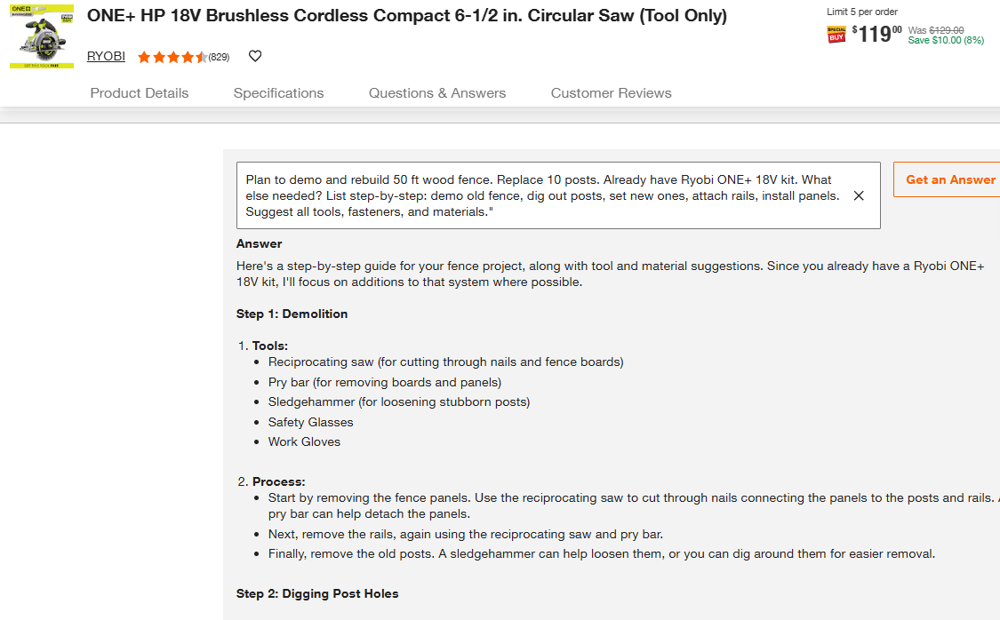

# MagicApron In-Store UO Program  
**A hands-on User Onboarding (UO) experience to engage Home Depot customers in-store**

---

## 🚧 Program Highlights

- **📍 Booth Setup**  
  Table booth placed near or at the Special Services entrance for optimal foot traffic.

- **🛠️ Live Demo Sessions**  
  Real-time interaction with customers using curated MagicApron queries and tasks.

- **📝 Weekly Program Report**  
  Includes user feedback, session highlights, and engagement analytics.

---

## 🎯 Engagement Targets

- **DIYers**  
  Identify usage behaviors and collect feedback to enhance the MagicApron experience for project-focused customers.

- **Pro Customers**  
  Early engagement and guided onboarding to promote long-term adoption among tradespeople and contractors.

- **HD Associates**  
  Internal champions who explore use cases, APIs, and advocate for deeper platform integration in-store.

---

## 🧠 Demo & Query Coaching

### Level 1 — General Q&A Queries
Basic product inquiries, tool lookups, and project recommendations.  

### Level 2 — "DeepSeek" Queries  
Step-by-step procedural prompts designed for serious project planning and high-revenue engagement.  

> 💡 _“DeepSeek” = deeper revenue potential for your store._

---

## 📋 Survey & Feedback

Used to guide product direction and measure user onboarding success:

- **ChatGPT Awareness** — Have you used ChatGPT before?
- **Perceived Value** — What would this help you accomplish?
- **IoU (Intent to Use)** — Would you consider using MagicApron in future projects?
- **Feature Wish List** — What features would make this tool more useful?

---

## 📊 Success Metrics for Store Management

- [ ] Is your store equipped to host regular MagicApron workshops?
- [ ] Do you have a process to recruit or educate Pro customers about MagicApron?
- [ ] Have you set up an in-store station or booth for live MagicApron experiences?
- [ ] Are team members trained to guide customers through Level 2 "DeepSeek" queries?

---

## 🔗 Learn More & Join the Conversation

- 🌐 [Reddit Community – MagicApron_LLM](https://www.reddit.com/r/MagicApron_LLM/)  

---

**Simon Chen**  

**Career Focus:**  
Patient engagement | Physician education | Customer experience SaaS | User Onboarding program

now working as a part=time associate at Store #8949 – Poway, CA

📞 (858) 733-1029  
📧 presenter.simon@gmail.com  

🔗 [LinkedIn Profile](https://www.linkedin.com/in/hsienchen/)

🔗 [Hobbyst Project ApronLLM](https://github.com/simonisHereHelp/apron_LLM)