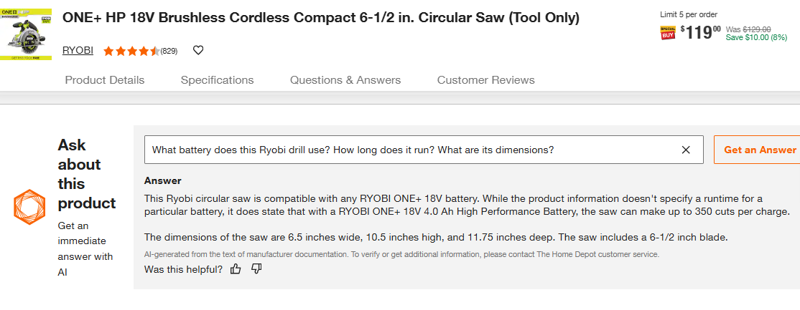

# In-Store UO Program, MagicApron  
**A hands-on User Onboarding (UO) program designed to engage store customers through live demos, booth presence, and feedback collection.**

---

## 🚧 Program Highlights

- **📍 Booth Setup**  
  In-store table booth positioned near or at the Special Services entrance to maximize visibility and foot traffic.

- **🛠️ Demo & Coaching**  
  Live MagicApron demonstrations with guided query coaching to help customers discover how to use the platform effectively.

- **📝 Feedback Collection**  
  Ongoing gathering of customer insights, feature requests, and engagement summaries for continuous program improvement.

---

## 🎯 Engagement Targets

- **DIYers**  
  Observing usage patterns and collecting insights to enhance the MagicApron experience for hands-on project customers.

- **Pro Customers**  
  Early exposure and education to foster adoption among tradespeople and regular contractors.

- **HD Associates**  
  Involving store team members to champion MagicApron internally and explore integration opportunities through APIs and use cases.

---

## 🧠 Demo & Query Coaching

### Level 1 — General Q&A Queries  
Typical customer-facing questions such as product selection, tool usage, or project setup.  

### Level 2 — "DeepSeek" Queries  
Structured, high-context queries designed to help customers plan projects and drive higher revenue.  

> 💡 _“DeepSeek” = deeper revenue potential for your store._

---

## 📋 Survey & Feedback

Key questions used to understand customer readiness, perceptions, and feature requests:

- **ChatGPT Awareness** — Have you used ChatGPT before?
- **Perceived Value** — What would you expect MagicApron to help with?
- **IoU (Intent to Use)** — Would you consider using it in future DIY or Pro projects?
- **Feature Wish List** — What else would make this app more useful to you?

---

## 📊 Store AI Success Checklist

- [ ] Do you know how DeepSeek-styled queries can help increase store sales?  
- [ ] Can your store run MagicApron workshops on a regular basis?  
- [ ] Do you have a way to introduce or teach Pro customers about MagicApron?  
- [ ] Is there a booth or station set up for customers to try MagicApron in-store?  
- [ ] Are your team members able to guide customers through Level 2 "DeepSeek" queries?
---

## 🔗 Learn More & Join the Conversation

- 🌐 [Reddit Community – MagicApron_LLM](https://www.reddit.com/r/MagicApron_LLM/)  

---

**Simon Chen**  

**Career Focus:**  
Patient engagement | Physician education | Customer experience SaaS | User Onboarding program

now working as a part=time associate at Store #8949 – Poway, CA

📞 (858) 733-1029  
📧 presenter.simon@gmail.com  

🔗 [LinkedIn Profile](https://www.linkedin.com/in/hsienchen/)

🔗 [Hobbyst Project ApronLLM](https://github.com/simonisHereHelp/apron_LLM)

## 📁 Additional Case References

- 🔗 [**DFC Website – Patient Recruitment**](./README-cases.md#dfc-website--patient-recruitment)  
- 🔗 [**Lunchbag CME – Physician Engagement**](./README-cases.md#lunchbag-cme---physician-engagement)
