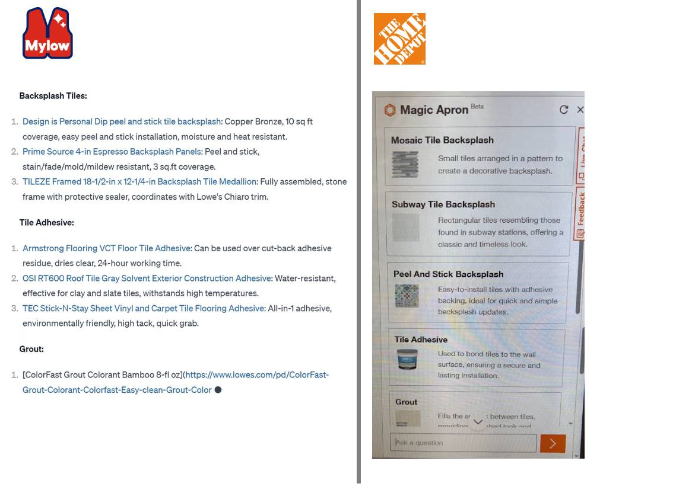
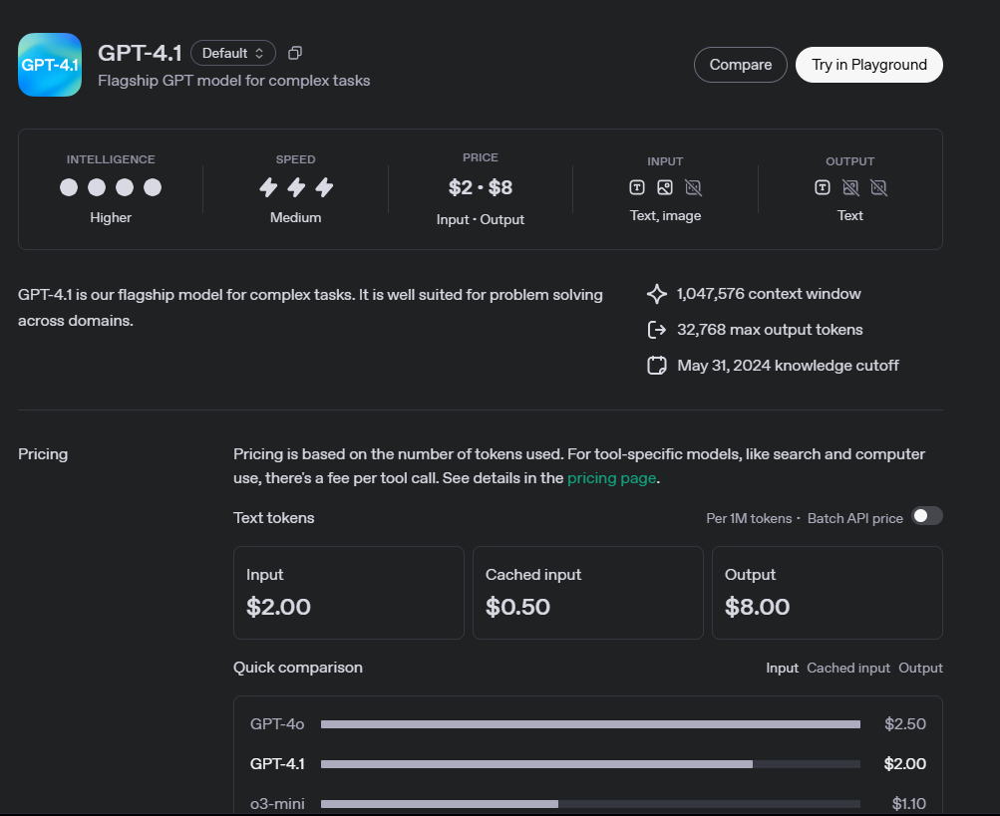

# Home Depot vs Lowes

"Hey there, I want to re-tile backsplash. Please recommend products that I would need."

| Feature           | Lowe’s LLM Response              | Home Depot Magic Apron             |
|------------------|----------------------------------|------------------------------------|
| **Tile Items in Cart**         | yes   | yes |
| **Adhesive Items in Cart**      | yes | yes     |
| **Grout Category in Cart**         | yes   | yes |
| **Tool Items in Cart**         | Not listed                    | yes |
| **Basket Size**  | est 12 SKUs | est 10 SKUs |
| **Layout Clarity**        | good, Text with markdown links         | fair, HTML-styled UI cards with icons    |
| **Guided Prompt** | ⬜ None                           | ☑️ Shown: “What tools do I need?” etc. |
| **Closer** | ⬜ None, lack purchase persuasion....                           | ⬜ None |
| **Photo Input**   | ☑️ Yes — accepts photo as input  | ⬜ No — text-based interaction only |

----

## Reasoning Model as a DIY Poroject Tool

-relevancy: delivering highly relevant and contextual response results

-CAC: lower CAC cust acquistion costs

-project: deliver project-contextual results

-omni channel: enable omni channel shopping experience

-conversion: optimize cart-based conversion rate success

## who are in the race?

https://github.com/themanojdesai/genai-llm-ml-case-studies/blob/main/case-studies/by-industry/e-commerce-and-retail.md

## Vimeo Video- Lowes

https://www.lowesinnovationlabs.com/projects/lowe-s-product-expert

## Lowe's OpenAI platform
