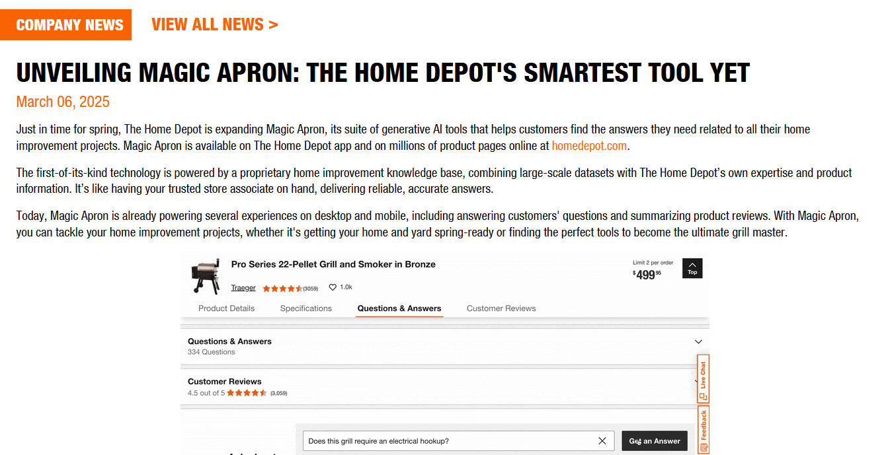
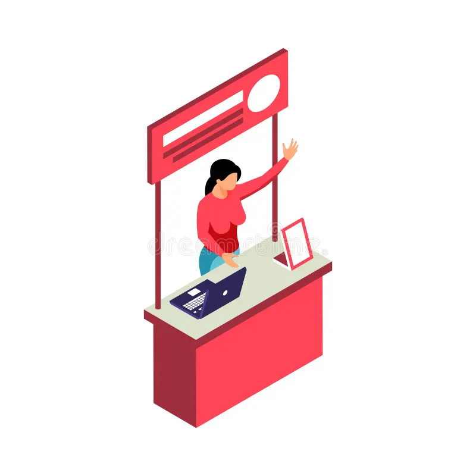
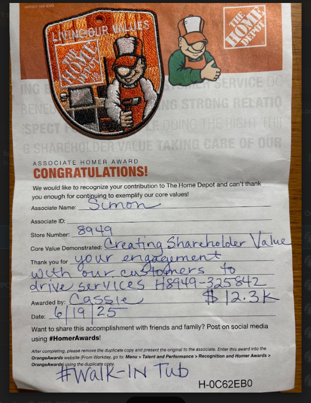
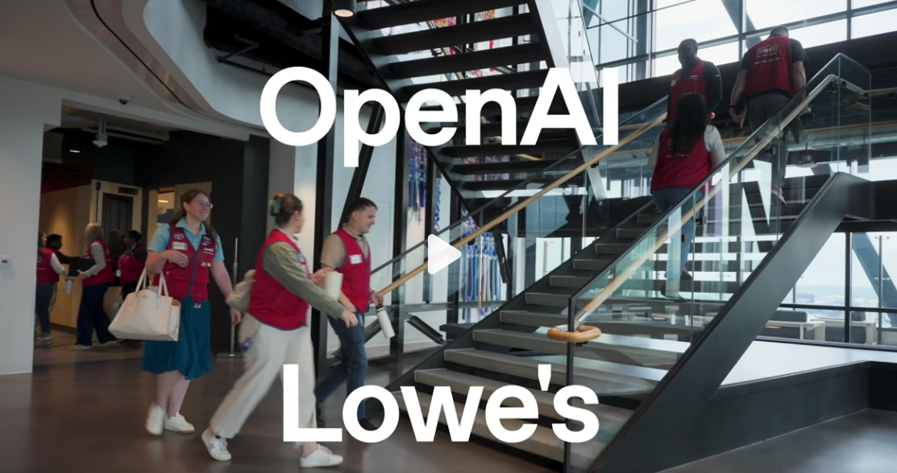
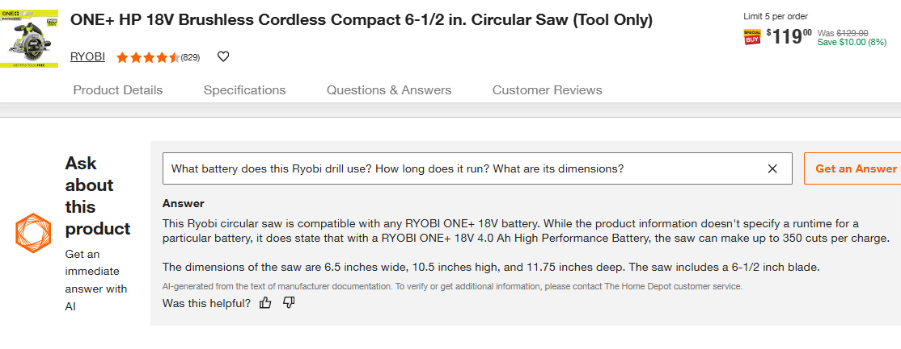
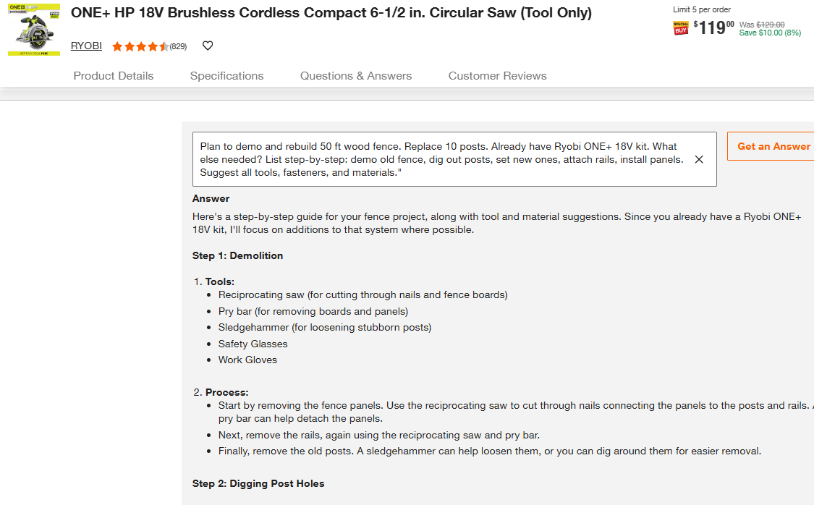
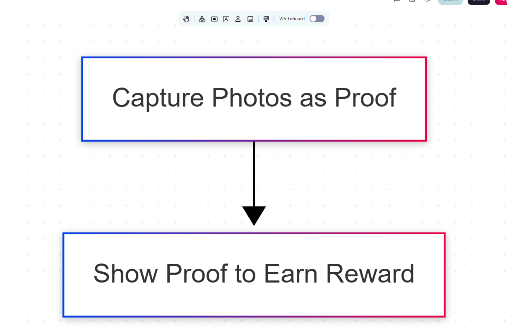
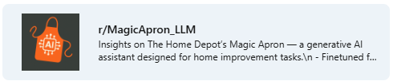
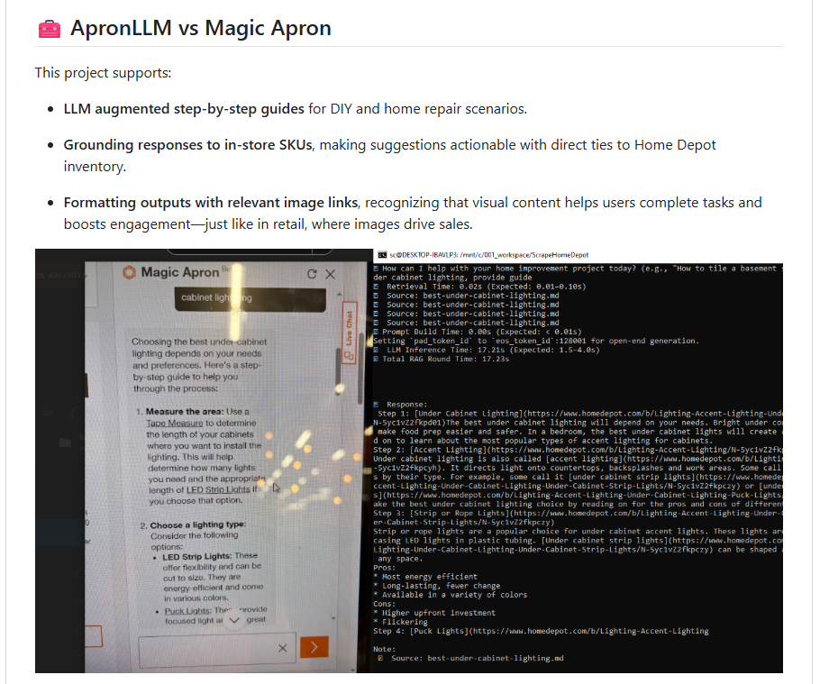

## WeAreMagic — A Trial Led by Associates to Bring AI Into Daily Store Work  

Home Depot has a new AI tool called Magic Apron.  

At **Store Poway**, we — the associates — want to try it out and see how it can help in real store situations.

We're running a **User Onboarding (UO)** trial to introduce this tool to customers and learn from the experience.

We will share findings in two key areas:

- 🧡 How Magic Apron can **support associates** — by making work easier and building confidence  

- 📈 How it can **help the store grow** — by giving customers better answers and increasing sales

We’re calling this trial **WeAreMagic** — because we believe AI can make our work more helpful, more efficient, and more rewarding.

 
 

**WeAreMagic**: Exploring how this tool can support our daily work and boost store revenue.

\newpage

## 1: Project Highlights
| **We want to explore on** | **We use these as a means** |
|----------------|---------------------------|
| - how to talk to cust about the tool | - **Demo booth**:  |
| - sale upside of the new practice   | - **Reward on Photo Proofs**:   |
| - customer's perspects  | - **Collect cust feedback**:   |

### Why Store Poway? Why Us?

-Right Customers — Engineers & white-collar DIYers   
-WeAreTHD-driven Team — supportive management, and motivated associates   
-UO-Ready — Prior experience with User Onboarding programs   
-Open Floor — Space available for booth & demos 
 

(image: In my view, Poway is the very right place!)
  

### Why now?

  
image: The race is on, OpenAI is in!

\newpage

## 2: to make a demo  

- **Level 1 — General Q&A Queries**  
  Covers quick, transactional questions typical in-store.  
  _Examples:_  
  - “What kind of paint should I use in a bathroom?”  
  - “Which drill bit works for masonry?”

  

- **Level 2 — DeepSeek Queries**  
  Designed for high-context, high-value scenarios. These simulate a project planning conversation.  
  _Examples:_  
  - “Help me build a 10x12 deck with composite boards.”  
  - “What do I need to re-tile my kitchen floor?”  

  

> 💡 DeepSeek = greater store revenue!

---

### to validate the impact on store sales

---

### 📋 we want to collect cust feedbacks

These questions help assess customer readiness and shape product features:

- **ChatGPT Awareness** — Have you used ChatGPT before?
- **Perceived Value** — What would you expect MagicApron to help with?
- **Intent to Use (IoU)** — Would you consider using MagicApron in a future DIY or Pro project?
- **Feature Wish List** — What would make this tool more useful for you?
 
 

## 3: UO Program — User Onboarding That Drives Adoption  
*I host forums on related AI-retail topics via Reddit and GitHub.*

### 🔗 Reddit Community  
- 🌐 [r/MagicApron_LLM](https://www.reddit.com/r/MagicApron_LLM/)  
A forum exploring how LLMs can reshape the retail experience — from the sales floor up.

---

### 🔗 Github: my work vs. Magic Apron  
Comparison of my prototype vs. the Magic Apron  

---

### 👤 Simon Chen — User Onboarding (UO) Program Specialist  

career focus: Customer Engagement SaaS | UO Strategy

**Clients:** Pfizer, Roche, J&J, Eisai-Biogen  

📞 (858) 733-1029  
📧 presenter.simon@gmail.com  
🔗 [LinkedIn](https://www.linkedin.com/in/hsienchen/)  
🔗 [ApronLLM on GitHub](https://github.com/simonisHereHelp/apron_LLM)

### 📁 Past UO Works  
- 🔗 [**DFC Website – Patient Recruitment**](./README-cases.md#dfc-website--patient-recruitment)  
- 🔗 [**Lunchbag CME – Physician Engagement**](./README-cases.md#lunchbag-cme---physician-engagement)
